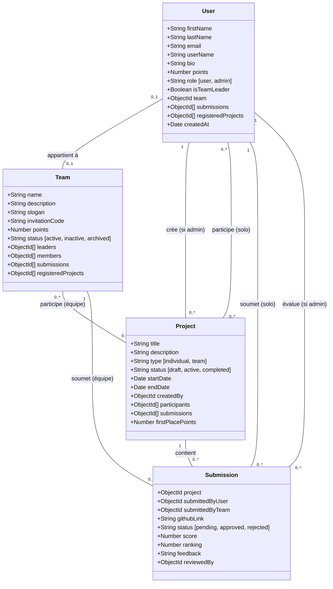

# Student Arena - MERN Project

Student Arena est une plateforme web moderne et dynamique dédiée aux compétitions de projets pour étudiants. Elle permet aux utilisateurs de s'inscrire à des projets (en solo ou en équipe), de soumettre leurs travaux et de grimper dans le classement mondial grâce à un système de points innovant et des fonctionnalités boostées par l'Intelligence Artificielle.

## 🚀 Fonctionnalités Principales

### 👤 Pour les Utilisateurs
- **Profil Personnalisé** : Suivi des points, des projets inscrits et des soumissions.
- **Gestion d'Équipe** : Création d'équipes, invitation de membres via codes uniques et gestion collaborative.
- **Participation aux Projets** : Inscription à des défis techniques avec des critères de succès clairs.
- **Soumissions GitHub** : Envoi de liens de dépôts sécurisés pour évaluation.
- **Classement (Leaderboard)** : Visualisation du top des étudiants et du top des équipes.

### 🤖 Fonctionnalités AI (Google Gemini 1.5 Flash)
- **Générateur de Bio** : Création automatique d'une bio professionnelle basée sur les compétences et intérêts.
- **Recommandations de Projets** : Algorithme prédictif suggérant des projets basés sur l'historique de l'utilisateur.
- **Assistant Chatbot** : Aide interactive pour naviguer sur la plateforme et comprendre les règles.
- **Idées de Projets** : Génération d'idées innovantes avec thèmes et difficultés réglables.

### 🛡️ Pour les Administrateurs
- **Gestion Complète** : Création, modification et suppression de projets.
- **Évaluation des Soumissions** : Système de revue, attribution de scores, feedbacks et classement final.
- **Modération** : Gestion des utilisateurs et des équipes (ajustement manuel des points).

---

## 🏗️ Architecture Technique

### Frontend
- **React 19** : Interface utilisateur réactive et performante.
- **Vite** : Outil de build ultra-rapide.
- **Vanilla CSS** : Design premium avec effets de glassmorphism, gradients dynamiques et micro-animations.
- **Axios** : Client HTTP avec intercepteurs pour la gestion automatique du JWT.
- **React Router 7** : Navigation fluide avec routes protégées.

### Backend
- **Node.js & Express** : Serveur API robuste et scalable.
- **MongoDB & Mongoose** : Base de données NoSQL avec schémas strictement typés.
- **JWT (JSON Web Tokens)** : Authentification sécurisée et persistante.
- **Google Generative AI** : Intégration de l'IA pour les fonctionnalités intelligentes.

---

## 📊 Modèle de Données (Diagramme de Classes)

Le diagramme suivant illustre les relations entre les différents modèles de la base de données :



---

## 🛠️ Installation et Lancement

### Prérequis
- Node.js installé
- MongoDB (local ou Atlas)
- Clé API Google Gemini

### Configuration
1. Clonez le dépôt.
2. Créez un fichier `.env` dans le dossier `backend/` :
   ```env
   PORT=5000
   MONGO_URI=vos_identifiants_mongodb
   JWT_SECRET=votre_secret_jwt
   GEMINI_API_KEY=votre_cle_api
   ```

### Lancement
**Backend :**
```bash
cd backend
npm install
npm run dev
```

**Frontend :**
```bash
cd Frontend/student-arena
npm install
npm run dev
```

L'application sera accessible sur `http://localhost:5173`.

---

## 🏆 Système de Points et Compétition

Le cœur de **Student Arena** est son système de gamification conçu pour encourager la persévérance et l'excellence :

### Distribution des Points
Lorsqu'un administrateur classe une soumission approuvée, les points sont distribués selon une logique de bonus :
- **Projet Individuel** :
    - L'étudiant reçoit **100%** des points du rang (ex: 100 pts pour la 1ère place).
    - Si l'étudiant appartient à une équipe, son **équipe reçoit un bonus de 50%** (50 pts) automatiquement.
- **Projet en Équipe** :
    - L'équipe reçoit **100%** des points du rang.
    - **Chaque membre** de l'équipe reçoit un **bonus individuel de 50%** des points.

### Statuts des Projets
1.  **Draft** : Projet en cours de création par l'admin (invisible aux étudiants).
2.  **Active** : Inscriptions et soumissions ouvertes.
3.  **Completed** : Le projet est terminé, les gagnants sont affichés.
4.  **Archived** : Historique consultable mais plus d'interaction possible.

---

## 🛡️ Sécurité et Performance

### Authentification JWT
L'application utilise une architecture **Stateless** basée sur les JSON Web Tokens :
- Les tokens sont stockés de manière sécurisée dans le `localStorage`.
- Un **Intercepteur Axios** injecte automatiquement le header `Authorization: Bearer <token>` dans chaque requête sortante.
- Les routes sensibles (Admin, Soumissions, Profil) sont protégées par un middleware côté backend qui vérifie l'intégrité du token.

### Intégrité des Données
- **Bcrypt.js** : Hashage des mots de passe avec un sel de 10 rounds avant stockage.
- **Mongoose Validation** : Schémas rigoureux empêchant les données incohérentes (doublons d'emails, pseudos déjà pris, liens GitHub malformés).
- **CORS** : Configuration stricte autorisant uniquement le domaine frontend officiel.

---

## 💎 Philosophie de Design (UI/UX)

Student Arena n'est pas qu'un outil, c'est une expérience visuelle "Premium" :
- **Aesthétiques Modernes** : Utilisation du *Glassmorphism* (effets de flou d'arrière-plan), de bordures semi-transparentes et de dégradés vibrants.
- **Micro-animations** : Transitions fluides à l'entrée des pages et effets de survol magnétiques sur les boutons et cartes.
- **Responsive Design** : Interface totalement adaptative fonctionnant parfaitement sur ordinateurs, tablettes et mobiles.
- **Dark Elements** : Utilisation stratégique de tons sombres (`#1e293b`) pour les actions principales afin de réduire la fatigue visuelle.

---

## 🔗 Aperçu des API

| Catégorie | Préfixe Route | Fonctionnalités Clés |
| :--- | :--- | :--- |
| **Auth** | `/api/auth` | Login, Register (Auto-admin pour le 1er inscrit) |
| **Users** | `/api/users` | Profil, Leaderboard, Changement de MDP, Statistiques |
| **Teams** | `/api/teams` | Création, Invitation, Join/Leave, Leadership |
| **Projects** | `/api/projects` | Listing, Inscription, Timeline de compétition |
| **Submissions** | `/api/submissions` | Dépôt GitHub, Review Admin, Attribution de points |
| **AI** | `/api/ai` | Bio, Recommandations, Chatbot, Génération d'idées |

---

## 🛠️ Documentation des API

Toutes les routes API sont préfixées par `/api`. Les routes marquées avec 🔒 nécessitent un token JWT. Les routes marquées avec 👑 nécessitent des privilèges Admin.

### 🔑 Authentification (`/auth`)
| Méthode | Route | Rôle | Description |
| :--- | :--- | :--- | :--- |
| `POST` | `/register` | Public | Inscription d'un nouvel utilisateur |
| `POST` | `/login` | Public | Connexion et réception du token |
| `POST` | `/logout` | 🔒 | Déconnexion (côté client) |
| `GET` | `/me` | 🔒 | Récupérer les infos de l'utilisateur connecté |
| `POST` | `/refresh-token` | 🔒 | Renouveler le token JWT |

### 👤 Utilisateurs (`/users`)
| Méthode | Route | Rôle | Description |
| :--- | :--- | :--- | :--- |
| `GET` | `/profile` | � | Profil complet de l'utilisateur |
| `GET` | `/leaderboard` | Public | Top 10 des utilisateurs |
| `GET` | `/` | 👑 | Liste de tous les utilisateurs |
| `POST` | `/` | 👑 | Création manuelle d'un utilisateur |
| `GET` | `/:id` | 🔒 | Profil d'un utilisateur spécifique |
| `PUT` | `/:id` | 🔒 | Mise à jour du profil |
| `PUT` | `/:id/password` | 🔒 | Changement de mot de passe |
| `DELETE` | `/:id` | 👑 | Suppression d'un compte |

### 👥 Équipes (`/teams`)
| Méthode | Route | Rôle | Description |
| :--- | :--- | :--- | :--- |
| `POST` | `/` | 🔒 | Créer une nouvelle équipe |
| `GET` | `/` | Public | Lister toutes les équipes |
| `GET` | `/:id` | Public | Détails d'une équipe |
| `POST` | `/join` | 🔒 | Rejoindre via `invitationCode` |
| `POST` | `/:id/leave` | 🔒 | Quitter l'équipe actuelle |
| `POST` | `/:id/add-member`| 👑/Leader | Ajouter un membre de force |
| `DELETE` | `/:id/members/:mId`| 👑/Leader | Expulser un membre |

### 📁 Projets (`/projects`)
| Méthode | Route | Rôle | Description |
| :--- | :--- | :--- | :--- |
| `GET` | `/` | Public | Liste de tous les projets |
| `GET` | `/active` | Public | Projets ouverts aux soumissions |
| `GET` | `/my-projects` | 🔒 | Projets auxquels je participe |
| `POST` | `/` | 👑 | Créer un nouveau projet |
| `POST` | `/:id/register`| 🔒 | S'inscrire à un projet |
| `PUT` | `/:id/status` | 👑 | Changer le statut (Active, Completed...) |

### 📝 Soumissions (`/submissions`)
| Méthode | Route | Rôle | Description |
| :--- | :--- | :--- | :--- |
| `POST` | `/` | 🔒 | Soumettre un lien GitHub |
| `GET` | `/my-submissions`| 🔒 | Voir mes propres soumissions |
| `GET` | `/` | 👑 | Voir toutes les soumissions à évaluer |
| `PUT` | `/:id/review` | 👑 | Noter et donner un feedback |
| `PUT` | `/:id/rank` | 👑 | Assigner un podium (1er, 2ème, 3ème) |

### 🏆 Classements (`/leaderboard`)
| Méthode | Route | Rôle | Description |
| :--- | :--- | :--- | :--- |
| `GET` | `/` | Public | Classement global |
| `GET` | `/users` | Public | Classement des étudiants |
| `GET` | `/teams` | Public | Classement des équipes |
| `GET` | `/project/:id` | Public | Gagnants d'un projet spécifique |

### 🤖 Intelligence Artificielle (`/ai`)
| Méthode | Route | Rôle | Description |
| :--- | :--- | :--- | :--- |
| `POST` | `/generate-bio` | 🔒 | Générer une bio via Gemini |
| `GET` | `/recommend-projects`| 🔒 | Projets suggérés via IA |
| `POST` | `/chat` | 🔒 | Interagir avec l'assistant IA |
| `POST` | `/generate-project-idea`| 🔒 | Générer une idée de projet innovante |

---

## �📂 Structure du Projet

```text
projet-mern/
├── backend/                # API REST Node.js
│   ├── config/             # DB & AI Config
│   ├── controllers/        # Logique métier
│   ├── middleware/         # Auth & Validation
│   ├── models/             # Schémas Mongoose
│   ├── routes/             # Endpoints API
│   └── server.js           # Point d'entrée
└── Frontend/
    └── student-arena/      # Application React
        ├── src/
        │   ├── api/        # Axios & API Standard
        │   ├── components/ # Composants UI
        │   ├── context/    # Gestion d'état (Auth)
        │   ├── pages/      # Pages (Home, Team, Admin...)
        │   └── index.css   # Styles Globaux
```

Développé Par Maroua HATTAB 
